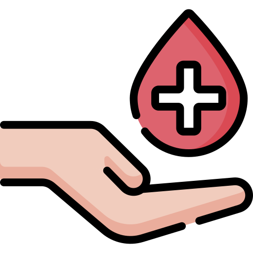
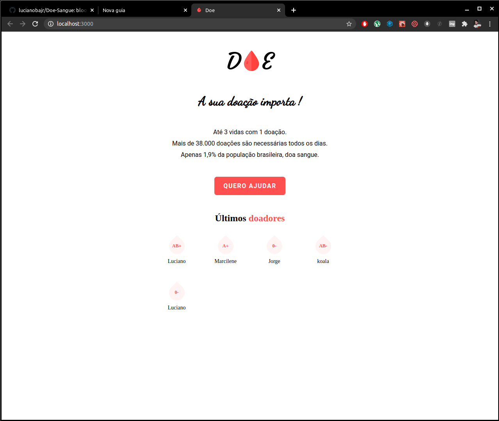
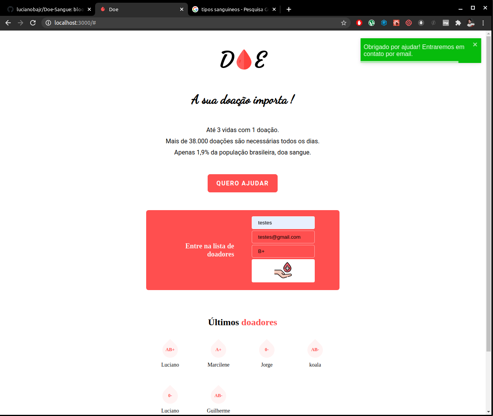
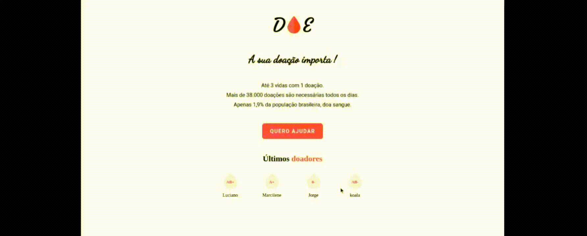
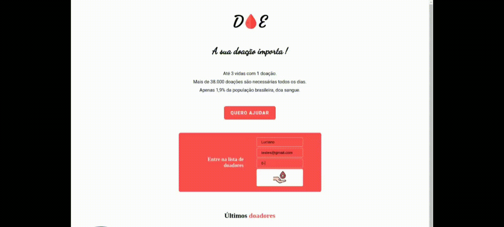

<h1 align="center">Bem vindo ao Doe-Sangue :wave: </h1>

 

# Primeira Versão

O Site 'Doe Sangue' foi desenvolvido a partir da "MaratonaDev" oferecida pela Rockeaset.

## Tecnologias :rocket:

:white_check_mark: NodeJs  
:white_check_mark: Html,css,Js    
:white_check_mark: PostgreSQL

Além do proposto ,foram implementados Dark-Mode  e duas animações ambos com css e Js 

    Dark-mode

    Animações de botão e Subtítulo

# Segunda Versão

A segunda versão do Doe-Sangue foi desenvolvida com o obejtivo de utilizar as  tecnologias mais atuais sem perder a essência da primeira versão!

## Tecnologias :rocket:

## Imagens :camera:

  